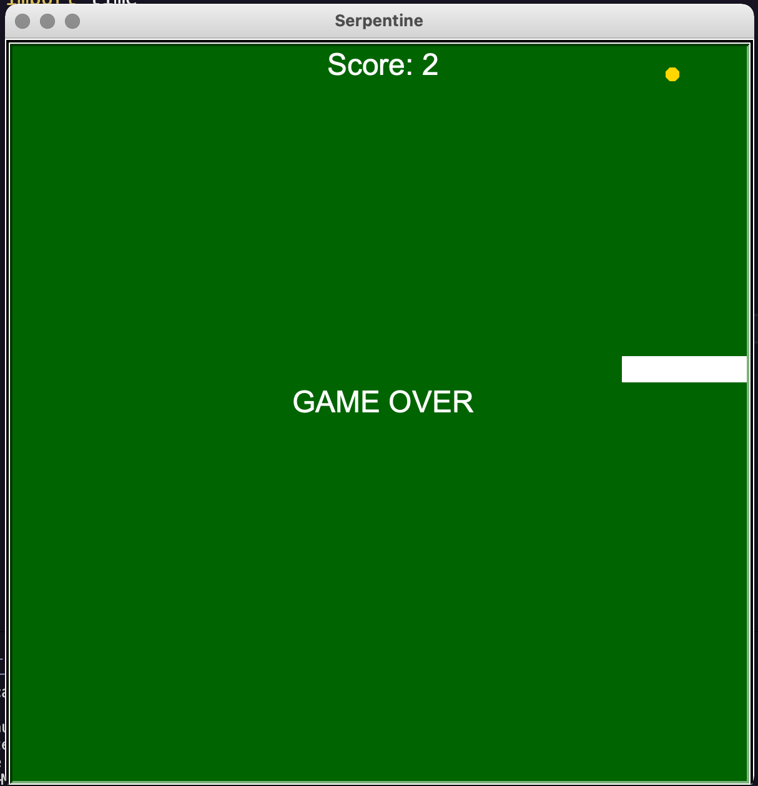

# Serpentine
Serpentine is written in Python and uses the Turtle module to recreate the classic mobile 'Snake' game.

## Controls
The game uses the arrow keys on the keyboard to maneuver a snake around a field attempting to collect food, which causes the snake to grow. Each food eaten increases the length of the snake and the player's score.

## Screenshot

## Roadmap
-Add a storage ability along to keep track of player's  highscores
-Add sound effects
-Further design the background